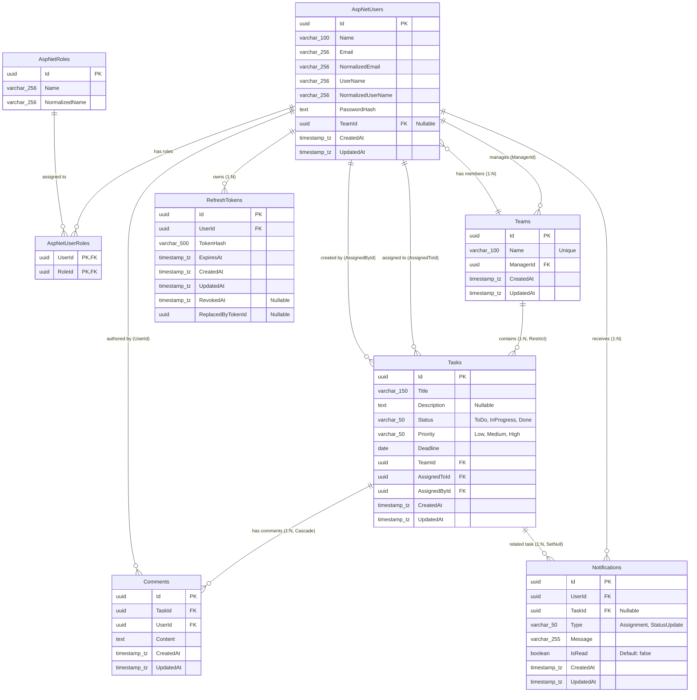

# Database Entity-Relationship (ER) Diagram

This document details the complete relational database design and schema for the **Team Task Management System**, built using **PostgreSQL 17** and **Entity Framework Core 10**.

---

## 1. Mermaid Entity-Relationship Diagram

---

## 2. Table Schemas & Foreign Key Constraints

### 2.1 `AspNetUsers`
- **Primary Key**: `Id` (`uuid`)
- **Foreign Keys**:
  - `TeamId` $\rightarrow$ `Teams.Id` (`ON DELETE SET NULL`)
- **Indexes**:
  - `NormalizedEmail` (`UNIQUE`)
  - `NormalizedUserName` (`UNIQUE`)
  - `TeamId` (`Index`)

### 2.2 `Teams`
- **Primary Key**: `Id` (`uuid`)
- **Foreign Keys**:
  - `ManagerId` $\rightarrow$ `AspNetUsers.Id`
- **Indexes**:
  - `Name` (`Case-Insensitive Unique`)
  - `ManagerId` (`Index`)

### 2.3 `Tasks` (`TaskItem`)
- **Primary Key**: `Id` (`uuid`)
- **Foreign Keys**:
  - `TeamId` $\rightarrow$ `Teams.Id` (`ON DELETE RESTRICT`)
  - `AssignedToId` $\rightarrow$ `AspNetUsers.Id`
  - `AssignedById` $\rightarrow$ `AspNetUsers.Id`
- **Indexes**:
  - `TeamId` (`Index`)
  - `AssignedToId` (`Index`)
  - `AssignedById` (`Index`)
  - `Status` (`Index`)
  - `Priority` (`Index`)
  - `Deadline` (`Index`)

### 2.4 `Comments`
- **Primary Key**: `Id` (`uuid`)
- **Foreign Keys**:
  - `TaskId` $\rightarrow$ `Tasks.Id` (`ON DELETE CASCADE`)
  - `UserId` $\rightarrow$ `AspNetUsers.Id`
- **Indexes**:
  - `TaskId` (`Index`)
  - `UserId` (`Index`)

### 2.5 `Notifications`
- **Primary Key**: `Id` (`uuid`)
- **Foreign Keys**:
  - `UserId` $\rightarrow$ `AspNetUsers.Id`
  - `TaskId` $\rightarrow$ `Tasks.Id` (`ON DELETE SET NULL`)
- **Indexes**:
  - `UserId` (`Index`)
  - `IsRead` (`Index`)
  - `TaskId` (`Index`)

### 2.6 `RefreshTokens`
- **Primary Key**: `Id` (`uuid`)
- **Foreign Keys**:
  - `UserId` $\rightarrow$ `AspNetUsers.Id`
- **Indexes**:
  - `UserId` (`Index`)
  - `TokenHash` (`Index`)

---

## 3. Referential Integrity & Delete Behaviors

1. **Teams $\rightarrow$ Tasks**: `DeleteBehavior.Restrict` prevents accidental deletion of teams with active tasks.
2. **Tasks $\rightarrow$ Comments**: `DeleteBehavior.Cascade` automatically cleans up associated discussion threads when a task is permanently removed.
3. **Tasks $\rightarrow$ Notifications**: `DeleteBehavior.SetNull` retains historical notification logs for users while nullifying the dead task reference.
4. **Refresh Tokens**: Cryptographic SHA-256 token hashes are stored with explicit expiration and revocation timestamps (`RevokedAt`).
